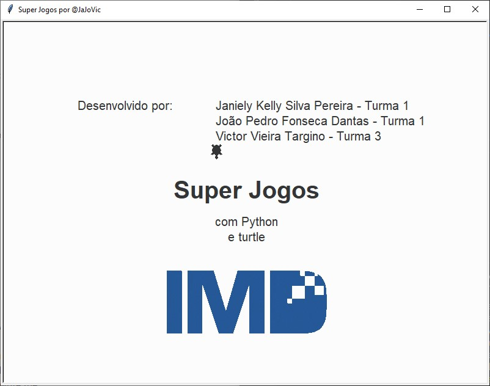
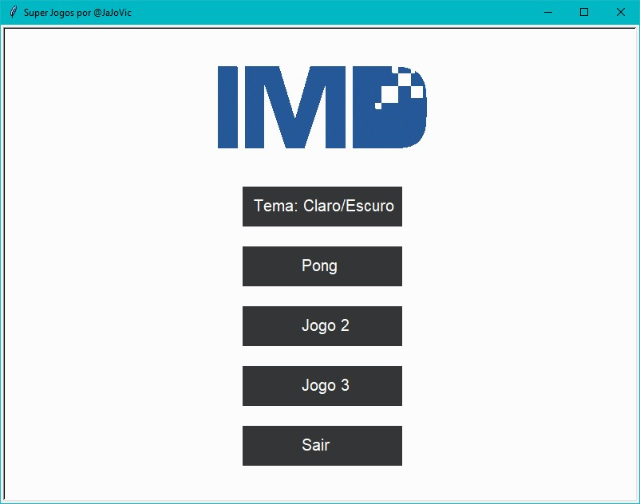
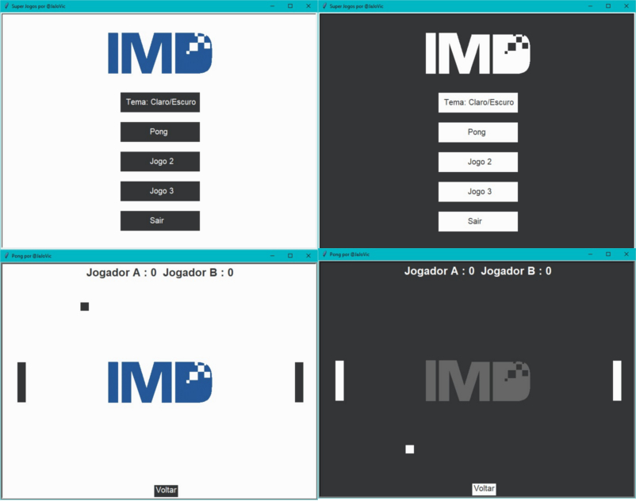

# Super Jogos
Projeto desenvolvido durante a matéria Pensamento Computacional, ministrada pelo professor Daniel Sabino, na UFRN. Neste projeto desenvolvemos um sistema com 3 jogos utilizando a biblioteca *turtle* e a linguagem *Python*.
>### Notas de atualização:
>* **Completo** (Part. Victor): A animação de iniciação do jogo, o menu e o Pong já estão todos integrados, bastar executar o *Principal.py*, quando o tema do menu é mudado o do jogo Pong também é.
>* **README(Completo)**: Acredito que toda descrição da minha parte do projeto esteja bem documentada, tudo pronto para ser utilizado como roteiro para o vídeo.

# Sumário
* [Contexto](##Contexto)
* [Conceitos](#Conceitos)
    * [Animação](##Animação)
    * [Menu](##Menu)
        * [Tema](###Tema)
    * [Pong](##Pong)
        * [Barra](###Barra)
        * [Bola](###Bola)
* [Referências](#Referências)
---

## Contexto
Jogos são ótimas fontes de entrenimento. Neles podemos nos divertir, nos emocionar, ver a realidade de formas que só são possíveis neles e até aprender. Além disso, um código fonte simples de um jogo pode ser uma poderosa ferramenta para auxiliar no aprendizado de determinada linguagem de programação e támbem diversos conceitos, pensando na simplicidade e no lado lúdico desta forma de arte foi criado o Super Jogos, um conjunto de 3 jogos em linguagem *python* e alguns utilizando a biblioteca *turtle*.

# Conceitos
Agora iremos descrever os conceitos mais importantes que fizeram parte de parte do projeto. Para tudo funcionar é necessário antes de tudo uma janela. Para fazer isso utilizamos os seguintes comandos.

```python
Janela = turtle.Screen()
Janela.title("Título da janela")
Janela.bgcolor("Cor do plano de fundo") #Nome da cor ou Hexadecimal (tavlez RGB?)
Janela.setup(width=Largura, height=Altura) #Númericos
while True: #Loop que mantém a janela aberta
    Janela.update()
```

## Animação
A animação ocorre assim que se inica arquivo *principal.py* , nela vemos uma tartaruguinha percorrendo a tela e por onde ela passa vai surgindo as palavras. Os conceitos mais fundamentais para compreender todo o projeto se encontram aqui. A figura abaixo demonstra como fica a janela ao final da animação.



Nela criamos uma tartaruga com nome apresentador. E atribuímos algumas características para ele ficar com essa forma.

```python
Apresentador = turtle.Turtle()
Apresentador.shape("turtle") #Forma da tartaruga
Apresentador.color("Cor da tartaruga")
```
Observe que no método [*.shape()*](https://docs.python.org/3/library/turtle.html#turtle.shape) podemos inserir diferentes formas para ela, desde formas geométricas simples, como de um quadradro,triângulo ou círculo até transformá-la usando um arquivo .gif (o único formato que turtle aceita), olhe o exemplo abaixo de como inserimos a logo no do *IMD* no projeto.

```python
Janela.addshape('SuaImagem.gif') #A logo é adicionada as formas possíveis
Logo = turtle.Turtle()
Logo.shape('SuaImagem.gif') #A tartaruga se transforma na logo
```

Caso deseje converter um arquivo para *.gif* nas referências tem um link.

## Menu

Após a animação inicial aparece o menu nele podemos escolher qual jogo vamos iniciar, trocar o tema dos jogos entre claro ou escuro. Nessa parte sistema podemos analisar dois elementos fundamentais, a troca do tema e os botões. O segundo conceito você poderá ver na sessão **Jogo da Velha**.


### Tema
Basicamente, quando o botão do tema é clicado a janela apaga tudo (botões e logo) e desenha todos os elementos com outras cores, e ao iniciarmos o jogo ele estará com o mesmo tema do menu. Observe na figura abaixo, a mudança de cores que acontece, e a da logo também.



Para isso temos que compreender como o tema é armazenado, o que acontece após o botão ser pressionado, como funciona a eliminação dos elementos da tela e o reaparecimento deles. 

O amarzenamento do tema funciona de maneira simples. Observe o código abaixo que está fora do loop while que mantém o jogo aberto (ler início do tópico conceitos).

```python
Claro = ['cor de fundo', 'cor dos elementos', 'Pasta/LogoDesseTema.gif', 'Nome do tema']
Escuro = ['cor de fundo', 'cor dos elementos', 'Pasta/LogoDesseTema.gif', 'Nome do tema']
Tema = Claro
```
Após o botão se acionado uma varável muda para o nome do que deve acontecer, dentro do loop principal há essa estrutura de decisão que ao identificar que ao identificar o nome da variável irá trocar o Tema, após isso as funções *Limpar()* e *Preencher* serão acionadas.
```python
if Acao == 'Tema: Claro/Escuro':
        Acao = ''
        if Tema == Claro:
            Tema = Escuro
        elif Tema == Escuro:
            Tema = Claro
        Limpar()
        Preencher()
```

A função *Limpar()* simplesmente esconde a logo e apaga todos os botões que foram criado, nessas duas linhas.

```python
Botao.clear()
Logo.hideturtle()
```
Na função *preencher()* a logo, que estava escondida, muda para outro arquivo *gif* e depois aparece na tela na mesma posição de antes, o plano de fundo muda sua cor usando *.bgcolor('cor')*, e os botões que foram todos apagados serão desenhados novamente, antes de começar e definido da margem do botão *.pencolor('cor')* e a cor que será preenchido *.fillcolor('cor')*, apos isso começa um loop que irá desenhar todos os botões, que não cabem a discussão no momento.

```python
global CordBotoes #Variável que diz a localização dos botões
CordBotoes = []
# Logo
Logo.shape(Tema[2])
Logo.showturtle()
# Plano de fundo
Janela.bgcolor(Tema[0])
#Desenha os botões
Botao.pencolor(Tema[1])
Botao.fillcolor(Tema[1])
for Item in range(0, len(Opcoes)):
    x = Inicio[0]
    y = Inicio[1] + Inicio[2]*Item
    DesenharBotao(Botao, Opcoes[Item], x, y)
    CordBotoes.append([x, y])
```

## Pong 
 
Podemos compreender o jogo Pong da seguinte forma. Há 3 elementos, duas barras e uma bola, as barras se movem para cima ou para baixo a partir de comandos pelo teclado. A bola sempre se move na diagonal e ao bater nas bordas superiores ou inferiores ela muda o sentido no eixo *y*, quando bate nas barras ela inverte o sentido no eixo *x* , caso chega as bordas laterais um ponto é marcado para o jogador da barra que está do lado oposto.

### Barra 
o funcionamento da barra **ocorre todo fora do loop** que mantém a janela aberta. Vamos analisar como funciona a criação da barra esquerda.

```python
BarraE = turtle.Turtle() #Cria-se uma tartaruga
BarraE.speed(0) #Sem animação na movimentação
BarraE.shape("square") #Forma
BarraE.color(Tema[1]) #Cor
BarraE.shapesize(stretch_wid=5, stretch_len=1) #Muda o tamanho da forma
BarraE.penup() #Esse comando evita que a Barra desenhe enquanto se move
BarraE.goto(-350, 0) #Define posição inicial da Barra
```
Com a barra criada e posicionada precisamos colocar movimento nela. Observe abaixo que cada botão do teclado ativa uma função que vai fazer a barra se movimentar.
```python
Janela.listen() #Sempre preparada para os comandos
Janela.onkeypress(BarraESobe, "w")
Janela.onkeypress(BarraEDesce, "s")
```

Observe uma função de exemplo, basicamente ela lê a coordenada atual da barra, adiciona um valor e defini o novo *y* como esse valor.
```python
def BarraESobe():
    if BarraE.ycor() < 245: #Impede que saia da janela
        y = BarraE.ycor() #Lê a coordenada y 
        y += 20
        BarraE.sety(y) #Defini novo y
```

### Bola
A bola é um elemento que deve sempre estar sempre mudando de espaço, além disso deve colidir com as bordas horizontais e com as barras, portanto vamos destrinchar seu funcionamento. Vamos pular a parte para defini-lá pois funciona da mesma forma que a barra.
```python
def BarraESobe():
# Velocidade da bola
Velocidade = 0.3
# Movimento da bola (varia de acordo com o computador)
Bola.dx = Velocidade
Bola.dy = Velocidade 
```
O *.dx* e *.dy* definem a velocidade da bola no jogo, no caso desse jogo ela aumenta toda vez que a bola bate na barra, mas não será aqui discutido esse mecanismo. Agora vamos ver como funciona a colisão da bola com a barra.
```python
# Esquerda
if Bola.xcor() < -340 #Bola um pouco perto da barra (evita bugs)
and Bola.xcor() > -350 #Bola não passou pela barra
and Bola.ycor() < BarraE.ycor() + 60 #Bola não passou da parte supeireior da barra
and Bola.ycor() > BarraE.ycor() - 60:#Bola não passou da parte inferior da barra
    Bola.setx(-340) #Defini a posição encostada na barra (evita bugs)
    Bola.dx *= -1 #Inverte o sentido x
```
O funcionamento de como a bola colide com as bordas e como os pontos são marcados é muito semelhante ao apresentado acima.
# Referências

### Texto
[Um breve tutorial do Turtle - Português](https://medium.com/reflex%C3%A3o-computacional/m%C3%B3dulo-turtle-d8949db55008)

[Documentação do Turtle - Português](https://docs.python.org/pt-br/3/library/turtle.html#module-turtle)

### Vídeo
[Vídeo de inspiração do Pong - Inglês](https://www.youtube.com/watch?v=XGf2GcyHPhc&t=19452s&ab_channel=freeCodeCamp.org)

[Vídeo de criação de um botão com Turtle - Inglês](https://www.youtube.com/watch?v=-XiZIEcDukY&ab_channel=RounakBhowmik)
### Converter .gif
[Online Convert Free](https://onlineconvertfree.com/pt/convert-format/png-to-gif/)

[Online Convert](https://imagem.online-convert.com/pt/converter-para-gif)
